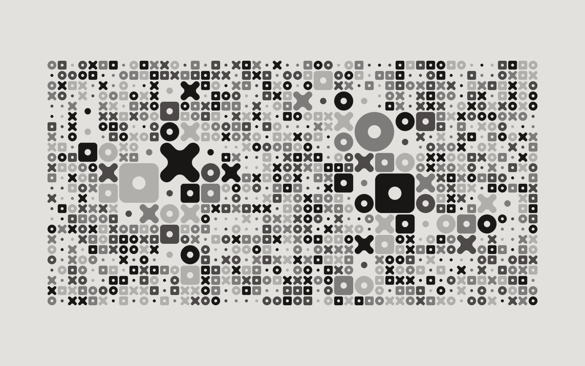
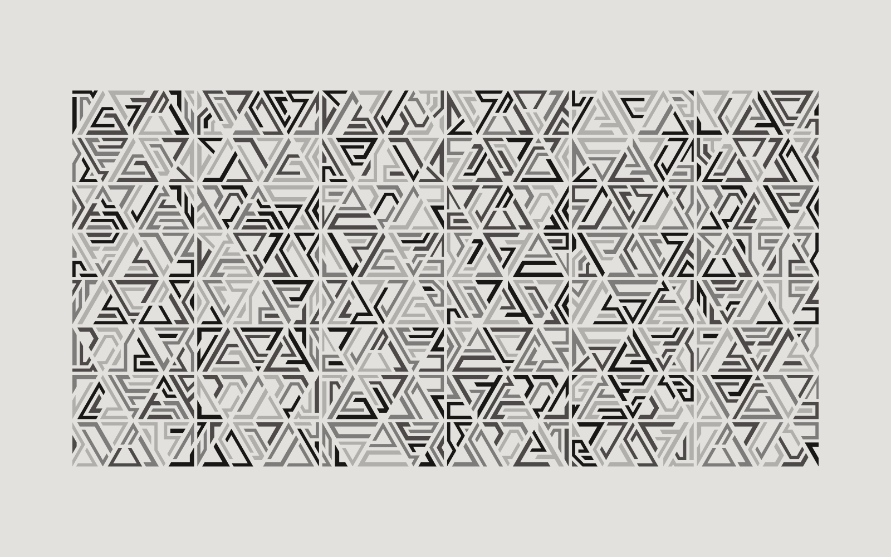
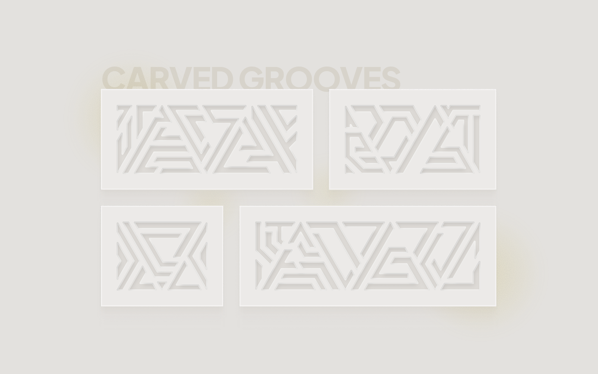
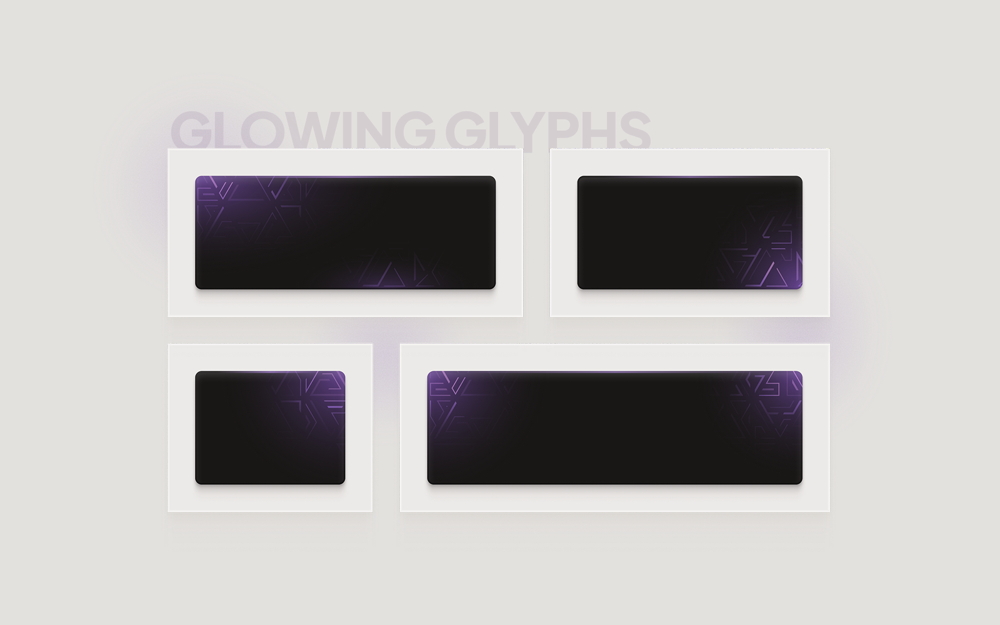

# Sanchez Pattern

Sanchez Pattern is a local-first web app for building deterministic SVG patterns from reusable shape libraries. It combines a visual editor, four generation methods, seeded variation, editable shape appearance, pattern history, and SVG or raster export.

Created by **Nick Sanchez - Mikołaj Grabowski**. Built from the **Toolcraft** starter and runtime by **Pixel Point**. See [NOTICE.md](NOTICE.md) for attribution details.

## Examples

### Pattern examples

<p>
  <a href="docs/assets/mosaic-pattern.png"></a>
  <a href="docs/assets/triangle-pattern.png"></a>
</p>

### Example usage

<p>
  <a href="docs/assets/example-usage-1.png"></a>
  <a href="docs/assets/example-usage-2.png"></a>
</p>

## What it can do

- Generate Base, Gradient, Mosaic, and Triangle patterns.
- Reproduce results with deterministic layout and appearance seeds.
- Mix bundled base and complex SVG shapes, collections, and variants.
- Import local SVG shapes into browser storage.
- Normalize frame size of equilateral and drafting-triangle artwork in `/shape-tools`.
- Control solid or gradient fills, opacity distribution, rotation, scale, and frame size.
- Keep and restore a browser-local history of generated patterns.
- Export the current result as SVG, PNG, or JPG.

The app has no backend, accounts, or cloud sync. User settings and history use `localStorage`; imported local shapes use IndexedDB.

## Quick start

Requirements: [Node.js 24](https://nodejs.org/) and npm.

```bash
cd sanchez-pattern
npm ci
npm run dev
```

Clone or download the repository first, then run the commands above from its parent directory.

Open the local URL printed in the terminal. The development server normally starts at `http://127.0.0.1:3002` and chooses another free port on its first run if needed.

For a production build:

```bash
npm run build
npm run preview
```

Chromium-based browsers are covered by the automated browser suite.

## Quality checks

```bash
npm run verify:quick   # contracts and app tests
npm run verify:ui      # browser acceptance
npm run verify:final   # complete release gate
```

## Contributing

Start with [CONTRIBUTING.md](CONTRIBUTING.md). Focused guides cover:

- [adding shapes and collections](docs/contributing/adding-shapes.md);
- [adding a pattern method](docs/contributing/adding-pattern-method.md);
- [bug fixes, optimizations, and UX improvements](docs/contributing/code-improvements.md);
- [the application architecture](docs/architecture.md).

Bug reports and proposals can use the repository issue forms. Please discuss broad behavior or architecture changes before investing in a large implementation.

## License and credits

The project is available under the [MIT License](LICENSE.md).

- Product-specific code, design, and bundled original shape assets: Copyright © 2026 Mikołaj Grabowski (Nick Sanchez).
- Toolcraft starter, runtime, UI components, documentation, and template source: Copyright © 2026 Pixel Point.
- Package-specific notices are listed in [THIRD_PARTY_NOTICES.md](THIRD_PARTY_NOTICES.md).
