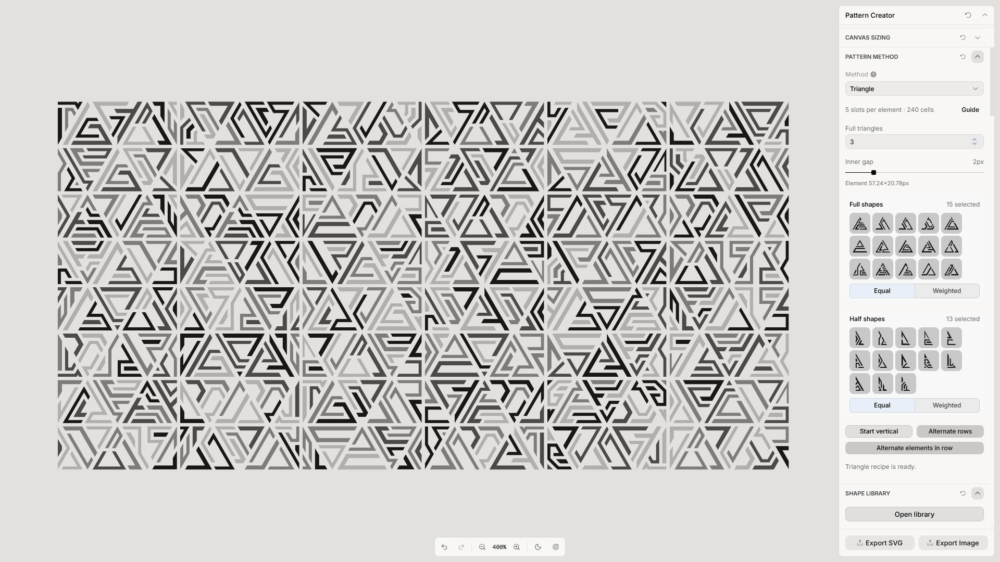
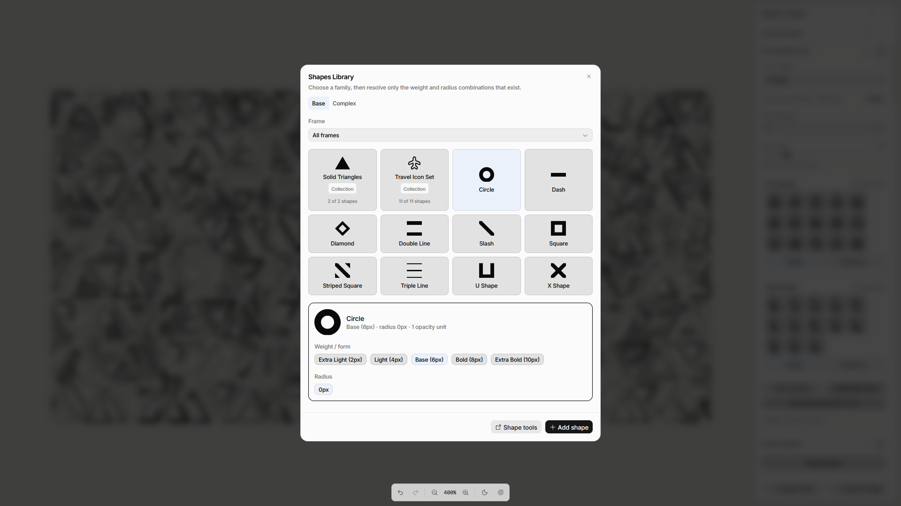
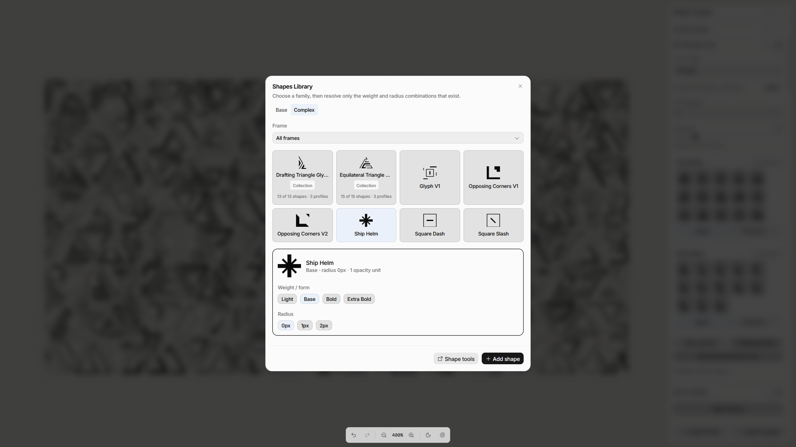
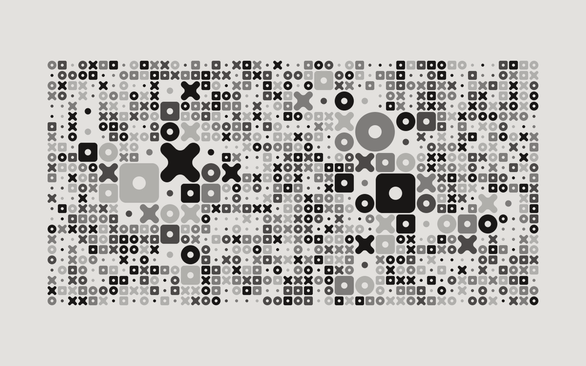
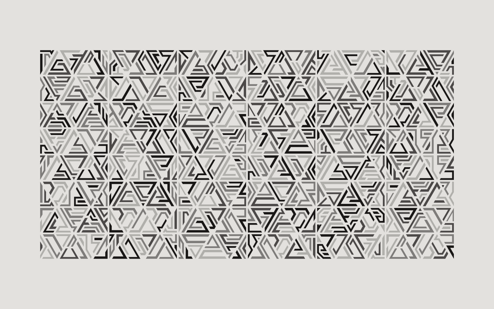
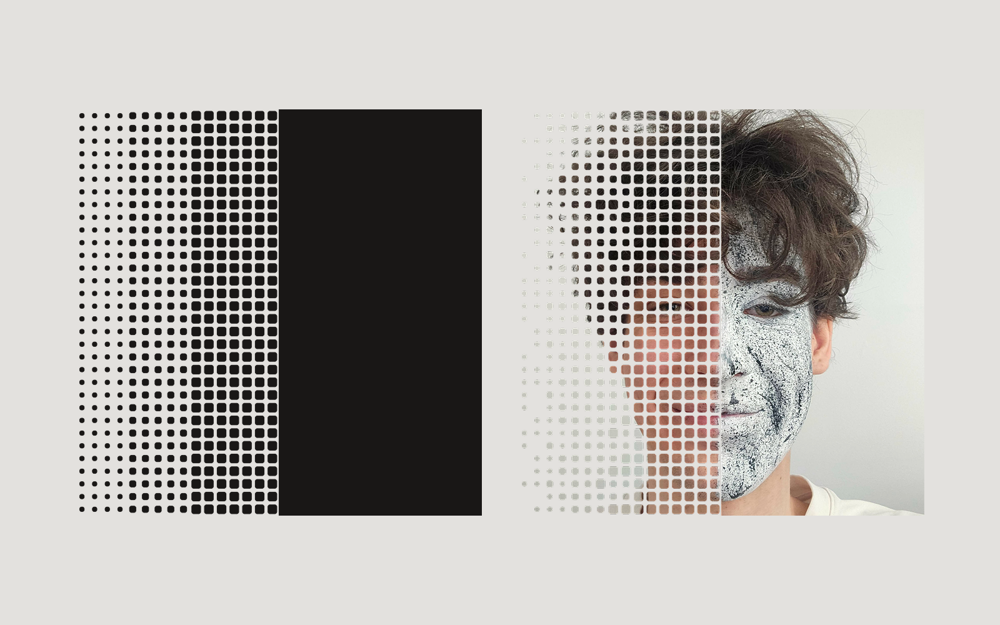
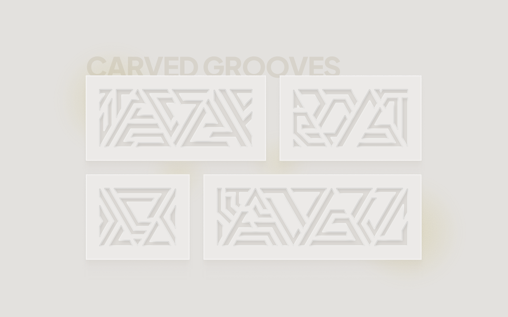
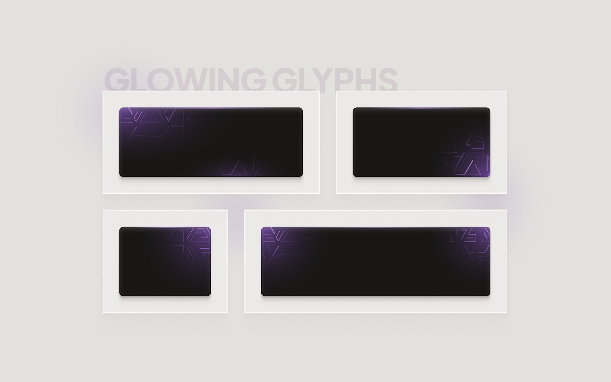
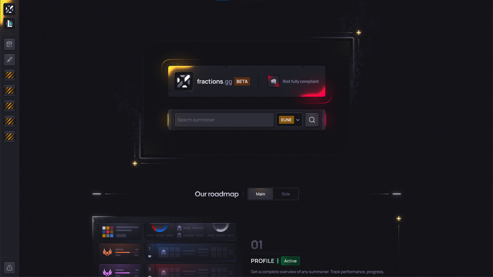
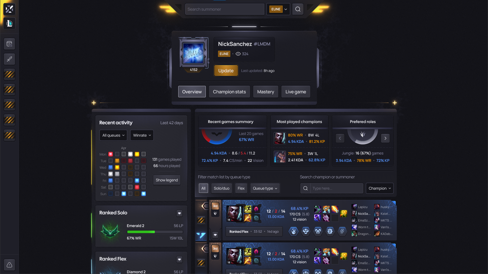

# Sanchez Pattern - designing a tool for distinctive interface patterns

Sanchez Pattern is a browser-based editor for building customizable patterns from a reusable SVG shape library. I created it as a personal project to explore how visual elements and generation rules could make pattern design more flexible for interface work.

**My role:** Product concept, original shape design, generation-method specification, and review of the resulting experience. I prepared detailed briefs and examples for Codex, which assisted with the React/TypeScript implementation. The application uses the Toolcraft starter and runtime by Pixel Point.

**Project:** Self-initiated, 2026 · **Output:** SVG, PNG, JPG · **Explore the code:** [Repository overview](../README.md)

  

_The editor brings the pattern, its generation settings, the shape library, and export actions into one workspace._

## The opportunity

Patterns can help give an interface its own visual character. I wanted to explore different compositions without manually rebuilding every arrangement of shapes. The idea was to separate the artwork from the rules that place it: design reusable shapes once, then experiment with how they are selected, sized, arranged, and styled.

This opportunity came from my own design workflow, rather than formal user research.

## Designing the system

### 1. Shapes as reusable building blocks

I created the original SVG artwork and organized it into shape families, variants, and collections. The editor lets a person select and combine sources from the library, adjust their appearance, and import additional local SVG shapes. This keeps the source artwork separate from the pattern recipe: one shape can participate in more than one composition.

  

  

_Base shapes contain one element or multiple elements of equal thickness. Complex shapes are those that do not meet this rule._

### 2. Four distinct composition methods

I specified four methods, each with a different way of arranging or distributing shapes:

| Method       | Compositional idea                                               |
| ------------ | ---------------------------------------------------------------- |
| **Base**     | A regular grid with adjustable shape distribution.               |
| **Gradient** | Shapes change through directional phases across the composition. |
| **Mosaic**   | Different shape sizes are arranged in clusters.                  |
| **Triangle** | One or more equilateral triangles between two right-triangle caps. |

  
  

I also used the Gradient method in a separate graphic composition with my own portrait. The left side shows the generated pattern on its own; the right shows one way it can be applied outside the editor. The portrait treatment is an example of use, not an image-editing feature inside Sanchez Pattern.

  

### 3. Exploring without losing a result

The editor separates adjusting a recipe from creating or updating a pattern. A seed makes a given set of settings reproducible, while browser-local history lets a person return to an earlier generated result. The preview and exported file are based on the same committed pattern, so the design selected in the editor is the one delivered.

<!-- OPTIONAL MEDIA: A short silent screen recording, approximately 30–45 seconds: select a method, add or change shapes, adjust two meaningful controls, create a pattern, revisit it in history, and export SVG or PNG. Add a poster image and link here if recorded. -->

## From pattern to interface

I placed the patterns in light and dark interface concepts to explore how the geometric language works alongside other content.

  
  

_Carved Grooves and Glowing Glyphs are visual application examples, not shipped client interfaces._

In a separate gaming interface I designed, the Triangle pattern takes a quieter role. It adds texture to selected panels and accents while leaving the information-heavy parts of the screen in the foreground.

  

_Search screen._

  

_Profile screen._

## Outcome and next questions

The result is a working local-first editor with browser-local settings and history, plus SVG, PNG, and JPG export. It has no account or backend.

I have not measured time saved or tested the tool formally with other designers. The next useful step would be to observe first-time users: Can they tell the four methods apart? Can they predict what the more specialized controls will change? And how easily can they take a generated result into a real interface project? Those questions would guide the next design iteration.

For technical details, setup instructions, licensing, and credits, see the [repository README](../README.md).
